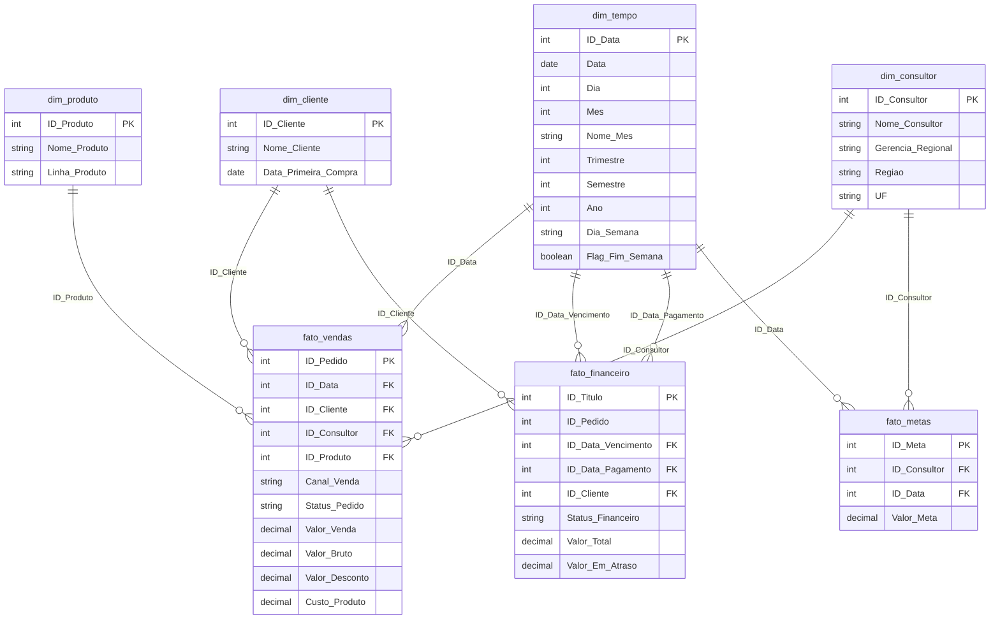

# Modelo de Dados — Performance Comercial

**Projeto:** Monitoramento de Performance Comercial
**Fontes:** ERP Protheus (SQL Server) · Planilha de Metas (Excel)
**Padrão:** Star Schema (Modelo Estrela)
**Histórico:** 24 meses | **Refresh:** Diário às 6h

---

## Diagrama ER



---

## Descrição das Tabelas

### Dimensões

| Tabela | Granularidade | Fonte | Campos-chave |
|---|---|---|---|
| `dim_tempo` | 1 linha por dia | Gerada via script | ID_Data (YYYYMMDD) |
| `dim_cliente` | 1 linha por cliente | dbo.Clientes | ID_Cliente |
| `dim_consultor` | 1 linha por consultor | dbo.Consultores | ID_Consultor |
| `dim_produto` | 1 linha por produto | dbo.Produtos | ID_Produto |

### Fatos

| Tabela | Granularidade | Fonte | Principais Métricas |
|---|---|---|---|
| `fato_vendas` | 1 linha por pedido | dbo.Pedidos | Valor_Venda, Valor_Bruto, Valor_Desconto, Custo_Produto |
| `fato_financeiro` | 1 linha por título/parcela | dbo.Financeiro | Valor_Total, Valor_Em_Atraso |
| `fato_metas` | 1 linha por consultor/mês | dbo.Metas | Valor_Meta |

---

## Hierarquia Comercial (dim_consultor)

```
Diretoria
└── Gerencia_Regional
    └── Nome_Consultor
        └── Regiao / UF
```

> Controle de acesso no Qlik: Consultor vê apenas os próprios dados,
> Gerente Regional vê sua gerência, Diretor vê tudo (Section Access).

---

## Indicadores por Tabela Fato

| Indicador | Fato | Fórmula resumida |
|---|---|---|
| Faturamento Realizado | fato_vendas | SUM(Valor_Venda) |
| Ticket Médio | fato_vendas | SUM(Valor_Venda) / COUNT(ID_Pedido) |
| % Desconto Médio | fato_vendas | SUM(Valor_Desconto) / SUM(Valor_Bruto) |
| Margem de Contribuição | fato_vendas | SUM(Valor_Venda - Custo_Produto) / SUM(Valor_Venda) |
| Taxa de Conversão | fato_vendas | COUNT(Fechados) / COUNT(Total) |
| Inadimplência | fato_financeiro | SUM(Valor_Em_Atraso) / SUM(Valor_Total) |
| Prazo Médio de Pagamento | fato_financeiro | AVG(ID_Data_Pagamento - ID_Data_Vencimento) |
| Meta de Faturamento | fato_metas | SUM(Valor_Meta) |
| % Atingimento de Meta | fato_vendas + fato_metas | SUM(Valor_Venda) / SUM(Valor_Meta) |
